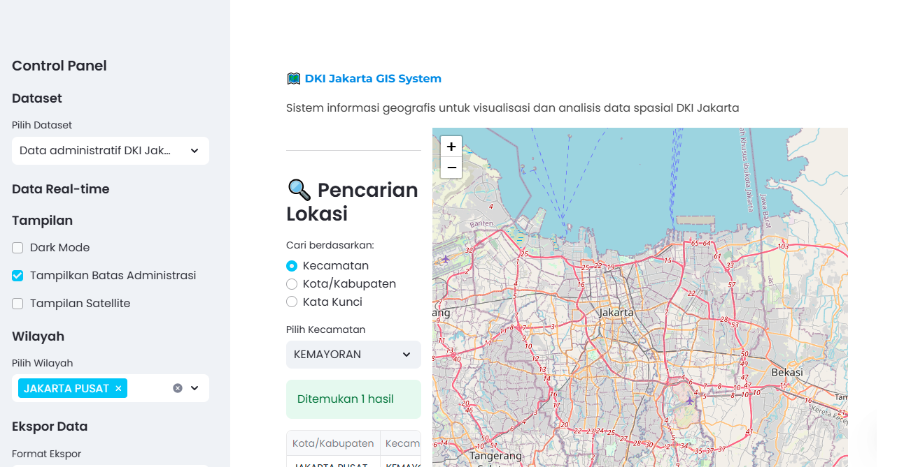

# DKI Jakarta GIS System 🗺️

An interactive Geographic Information System for DKI Jakarta that enables visualization and analysis of spatial data.




## Features

- **Interactive Map Visualization**: View and analyze DKI Jakarta regions with customizable layers
- **Administrative Boundaries**: Display district and sub-district boundaries
- **Multiple Display Options**: Toggle between regular, satellite, and night view map layers
- **Dark Mode Support**: Full support for dark mode viewing
- **Data Filtering**: Filter map data by regions and categories
- **Real-time Data**: View real-time data from various sources
- **Data Export**: Export data in CSV, GeoJSON, or as comprehensive reports

## Getting Started

### Prerequisites

- Python 3.11 or higher
- Required Python packages (automatically installed with the project):
  - streamlit
  - folium
  - geopandas
  - streamlit-folium
  - pandas
  - trafilatura
  - twilio

### Running the Application

To run the application locally:

```bash
streamlit run main.py
```

The application will be available at http://localhost:8501

## Project Structure

```
├── .streamlit/           # Streamlit configuration
│   └── config.toml       # App configuration settings
├── components/           # UI components
│   ├── map_view.py       # Map visualization component
│   └── sidebar.py        # Sidebar control panel component
├── data/                 # Data files
│   ├── jakarta.geojson   # GeoJSON data for Jakarta
│   └── metadata.json     # Dataset metadata
├── utils/                # Utility modules
│   ├── data_fetcher.py   # Data retrieval utilities
│   ├── data_loader.py    # Data loading utilities
│   ├── data_manager.py   # Data management utilities
│   ├── export_utils.py   # Data export utilities
│   └── map_utils.py      # Map manipulation utilities
└── main.py               # Main application entry point
```

## Usage Guide

1. **Selecting a Dataset**: Choose from available datasets in the sidebar
2. **Filtering Regions**: Select specific regions to display using the multi-select box
3. **Toggling Layers**: Enable/disable administrative boundaries and switch between map types
4. **Dark Mode**: Toggle dark mode for better viewing in low-light environments
5. **Viewing Real-time Data**: Check the real-time data sources to get updated information
6. **Exporting Data**: Select your preferred format and export data for offline analysis

## Contributing

Contributions are welcome! Please feel free to submit a Pull Request.

## License

This project is licensed under the MIT License - see the LICENSE file for details.

## Acknowledgments

- Streamlit for the web application framework
- Folium for the interactive map capabilities
- GeoPandas for the spatial data handling

silahkan email habizinnia@gmail.com jika butuh repo ini